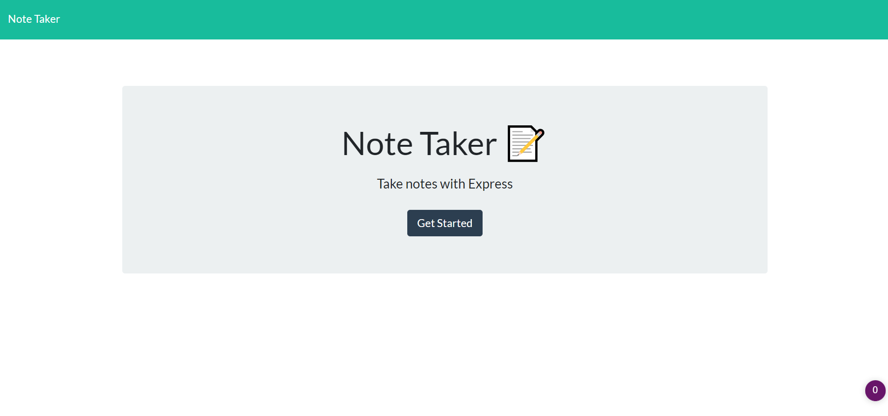
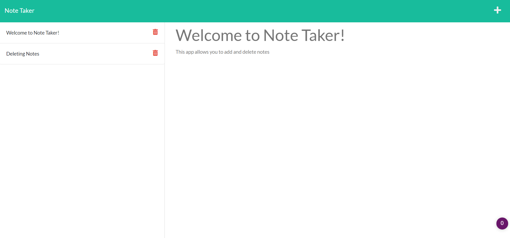

# NoteTaker


## Description
A simple note taker applciation using express js in the backend and is able to retrieve or delete saved notes from a JSON file. 

## Deployed Application

Click [here](https://still-dawn-65354.herokuapp.com/) to see the deployed application on Heroku

Click [here](https://hannahnmcdonald.github.io/NoteTaker/) to see the deployed application on Github Pages

## User Story

```
AS A small business owner
I WANT to be able to write and save notes
SO THAT I can organize my thoughts and keep track of tasks I need to complete

```

## Acceptance Criteria 

```
GIVEN a note-taking application
WHEN I open the Note Taker
THEN I am presented with a landing page with a link to a notes page
WHEN I click on the link to the notes page
THEN I am presented with a page with existing notes listed in the left-hand column, plus empty fields to enter a new note title and the note’s text in the right-hand column
WHEN I enter a new note title and the note’s text
THEN a Save icon appears in the navigation at the top of the page
WHEN I click on the Save icon
THEN the new note I have entered is saved and appears in the left-hand column with the other existing notes
WHEN I click on an existing note in the list in the left-hand column
THEN that note appears in the right-hand column
WHEN I click on the Write icon in the navigation at the top of the page
THEN I am presented with empty fields to enter a new note title and the note’s text in the right-hand column


```

## Table of Contents
1. [Screenshot](##Screenshot)
2. [Technologies](##Technologies)
3. [License](##License)
4. [Contributing](##Contributing)
5. [Questions](##Questions)


## Screenshot

Example of generated HTML: 





## Technologies

* Node.js
* express js
* npm
* Heroku


## License

This repository is under the MIT License.


## Contributing

1. Fork the repo from Github
2. Clone the repo locally
3. Commit your changes
4. Push to your branch
5. Open a Pull request for review

## Questions?

Contact me at hannahcodes@protonmail.com 📫

